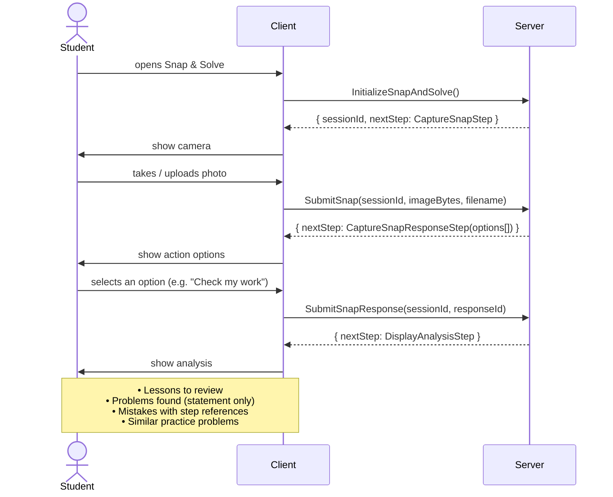

# Snap & Solve — Session Flow

```mermaid
sequenceDiagram
    actor Student
    participant Client
    participant Server

    Student->>Client: opens Snap & Solve

    Client->>Server: InitializeSnapAndSolve()
    Server-->>Client: { sessionId, nextStep: CaptureSnapStep }

    Client->>Student: show camera

    Student->>Client: takes / uploads photo

    Client->>Server: SubmitSnap(sessionId, imageBytes, filename)
    Server-->>Client: { nextStep: CaptureSnapResponseStep(options[]) }

    Client->>Student: show action options

    Student->>Client: selects an option (e.g. "Check my work")

    Client->>Server: SubmitSnapResponse(sessionId, responseId)
    Server-->>Client: { nextStep: DisplayAnalysisStep }

    Client->>Student: show analysis
    note over Client,Student: • Lessons to review<br/>• Problems found (statement only)<br/>• Mistakes with step references<br/>• Similar practice problems
```
